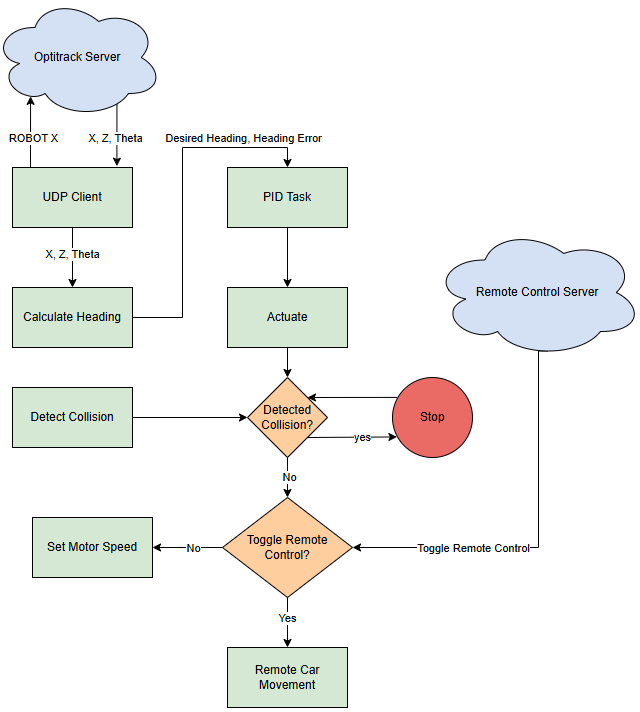

# Autonomous Robot

Authors: Cristian Palencia, Yohan Kim, Tanveer Dhilon, Zhilang Gui

Date: 2024-12-05

### Summary
In this project, we built a simple wheeled robot for the purpose of traversing an indoor course. The robot was able to navigate through a path defined by a set of waypoints. Positioning was done using a motion captured system called Optitrack that passes coordinates to a node.js app hosted in the lab. A sharp IR range sensor was used to detect collisions as well. 

In order to get the wheeled robot working, we first interfaced the ESP32 to the car through the use of the H-bridge and motor PWM. We then mounted the sharp IR range sensor onto the car for collison detection. We then interfaced the ESP32 to the positioning system in the lab using a UDP client. This requests the node server for the current x, z, and theta values for the ESP32. Using PID control, we created a design for driving control that will allow the car to move from one waypoint the next, make corrections to ensure the car remains on path, avoid collisions using the IR range snesor, and succesffuly make turns to drive on a continuous path. A remote control mode was also enabled to allow a human to control the car with WASD, with a button press allowing the user to switch from self-driving mode to remote controlled mode. 

### Solution Design
The solution consisted of multiple **hardware** components including:
- ESP32
- Sharp IR Range Sensor
- Motors and H-Bridge
- Optitrack

and several **software** components including:
- Self-Driving
- Collision Detection
- WASD Control

#### Hardware Design

##### ESP32
The ESP32 in this case functions as the main processing and communication unit. It communicated with the optitrack server while also calculating necessary movements in order to stay on the course. 

##### Sharp IR Range Sensor
The Sharp IR Range Sensor was used in order to read in an analog voltage into the ESP32. Using the analog voltage we would be able to implement collision detection for the purple cars. By specifically using the spec sheet we ccould convert a given analog voltage to an actual distance. 

##### Motors and H-Bridge
To implement the H-Bridge we connected GPIO pins to pins 2 and 7, and 10 and 15 on the H-Bridge. We then connected PWM signals to pins 1 and 9 (the enable pins) in order to control the power to the car. Finally, we connected power to pins 3 and 6, and 11 and 14 of the H-Bridge. With this wiring setup we then wrote some code to, first, setup PWM to the proper ESP32 pins and to control the GPIO pins to have full control of the car's movements.

##### Optitrack
The Optitrack system was used to collect relevant data about a given Purple Car. Using the optitrack we could obtain relevant information about a Purple Car's position and angle on the system. Using this information allowed us to implement PID logic into our system for self-driving.

#### Software Design

##### Self-Driving
Self-Driving was implemented using a PID loop. The PID would specifically analyze the error between the expected angle towards the current waypoint and the actual angle given by the optitrack system. By implementing a PID loop that would analyze the postive or negative error we could tell our Purple Car to move left or right to varying degrees (how hard to turn). 

By modifying the different constant values we could control the following considerations:
  - **Proportional (P)**: Corrects heading error based on the current deviation.  
  - **Integral (I)**: Reduces cumulative errors over time (set to 0 in this implementation for simplicity).  
  - **Derivative (D)**: Prevents overshooting by accounting for the rate of error change.

Another piece of logic required for self driving was whether the purple car arrived at a waypoint so that it could proceed to the next one. Waypoint detection was implemented by calculating the current distance away from the waypoint location. If the distance was 200 or below we would consider that the car reached the current waypoint and could move onto the next one. 

##### Collision Detection
Collision detection was implemented using the Sharp IR Range Sensor. If the Range Sensor detected a presense within 25 cm it would fully stop the car and any attempts to move it forward.

##### WASD Control
In order to implement WASD Control we implemented a node app that would host an html file to interpret WASD and Q inputs. Q would toggle between the self driving mode and WASD mode. After switching to the WASD mode we would be able to read in a WASD input and move the car appropriately.

<p align="center">

</p>
<p align="center">
Code Flow Chart
</p>


### Project Summary
In this project, we successfully built two simple wheeled robots that were able to concurrently traverse an indoor course while avoiding collision with any obstacles. This path was defined using a set of waypoints and feedback control was used for dirbing on line segements between waypoints. Positioning was done using Optitrack in which we linked the device to the node.js. The device was also able to traverse, and succesffuly able to traverse all waypoints in one gp with no hits or nudges. A sharp IR range sensor was also used for collision detection. 

Some challenges faced during the quest was working with the angle plane that was provided. It felt pretty unintuitive to work with the angle plane since it did not match the basic coordinate plane for the track. Furthermore, another difficult part about the quest was fine tuning the PID paramemters several times until we got an appropriate and desired behavior from our Purple Car.


### Supporting Artifacts
- [Link to video technical presentation](). Not to exceed 120s
- [Link to video demo](https://drive.google.com/file/d/1pCS9vckuFYlIf6aCmPLMsRiZipL1e3xR/view?usp=drive_link). Not to exceed 120s


### AI and Open Source Code Assertions

- We have documented in our code readme.md and in our code any software that we have adopted from elsewhere
- We used AI for coding and this is documented in our code as indicated by comments "AI generated" 


CHATGPT Snippets:
- actuate on PID function: Asked for help on how to control motor speed based on input value
```c
// Actuate function to adjust motor speeds
void actuate(float value) {
    // Constants
    const int MAX_DUTY = 1023;      // Maximum duty cycle for 10-bit resolution
    const int BASE_DUTY = 1023;      // Base duty cycle for normal speed
    const float K = 27.0;           // Scaling factor for adjustment (adjust as needed)

    // Variables for motor duty cycles
    int left_duty = BASE_DUTY;
    int right_duty = BASE_DUTY;

    // Calculate adjustment based on PID output
    int adjustment = (int)(K * fabs(value));

    // Adjust motor speeds based on error
    if (value > 0) {
        // Positive error: decrease right motor speed
        right_duty = BASE_DUTY - adjustment;
    } else if (value < 0) {
        // Negative error: decrease left motor speed
        left_duty = BASE_DUTY - adjustment;
    }

    // Ensure duty cycles are within valid range
    if (left_duty < 0) left_duty = 0;
    if (right_duty < 0) right_duty = 0;
    if (left_duty > MAX_DUTY) left_duty = MAX_DUTY;
    if (right_duty > MAX_DUTY) right_duty = MAX_DUTY;

    // Update PWM duty cycles for the motors
    if (stop) {
        set_motor_speed(LEDC_CHANNEL_LEFT, 0);
        set_motor_speed(LEDC_CHANNEL_RIGHT, 0);
    }
    else {
        if (!remote) {
            set_motor_speed(LEDC_CHANNEL_LEFT, right_duty);
            set_motor_speed(LEDC_CHANNEL_RIGHT, left_duty);
        }
        else {
            car_movement();
        }
    }
    // Print debug information
    printf("Desired angle: %.2f degrees \n", theta_d);
    printf("Heading error: %.2f degrees \n", ehead);
    printf("Control signal (value): %.2f\n", value);
    printf("Left motor duty cycle: %d\n", left_duty);
    printf("Right motor duty cycle: %d\n\n", right_duty);
}
```

- compute theta error for pid loop: asked for help about the best way to compute the error in our angle (phi) based on our current theta and position from the optitrack sever 
```c
// Calculate desired heading and heading error
void calculate_heading(double x_c, double z_c, double theta_c, double x_w, double z_w) {
    // Calculate the differences in coordinates
    double delta_x = x_w - x_c;
    double delta_z = z_w - z_c;

    // Calculate the standard angle (theta_std) in degrees
    double theta_std = atan2(delta_z, delta_x) * (180.0 / PI);

    // Adjust theta_std to the robot's coordinate system to get theta_d
    double thetad = fmod(270.0 - theta_std + 360.0, 360.0);

    // Calculate the heading error (ehead)
    double Ehead = fmod(thetad - theta_c + 360.0, 360.0);
    if (Ehead > 180.0) {
        Ehead -= 360.0;
    }

    // Protect shared variables with mutex
    xSemaphoreTake(xMutex, portMAX_DELAY);
    theta_d = thetad;
    ehead = Ehead;
    xSemaphoreGive(xMutex);
}
```
